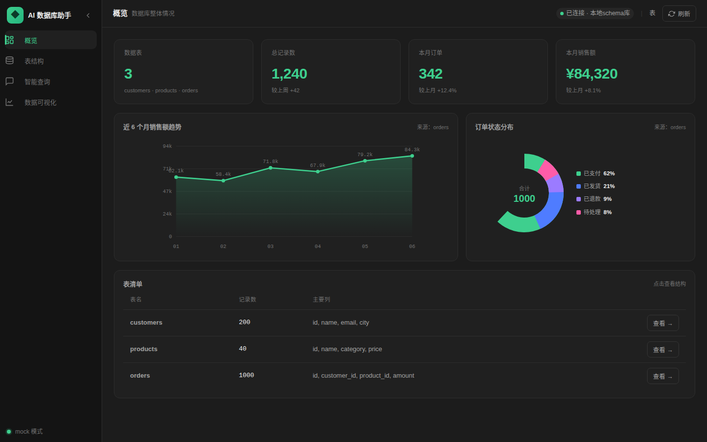
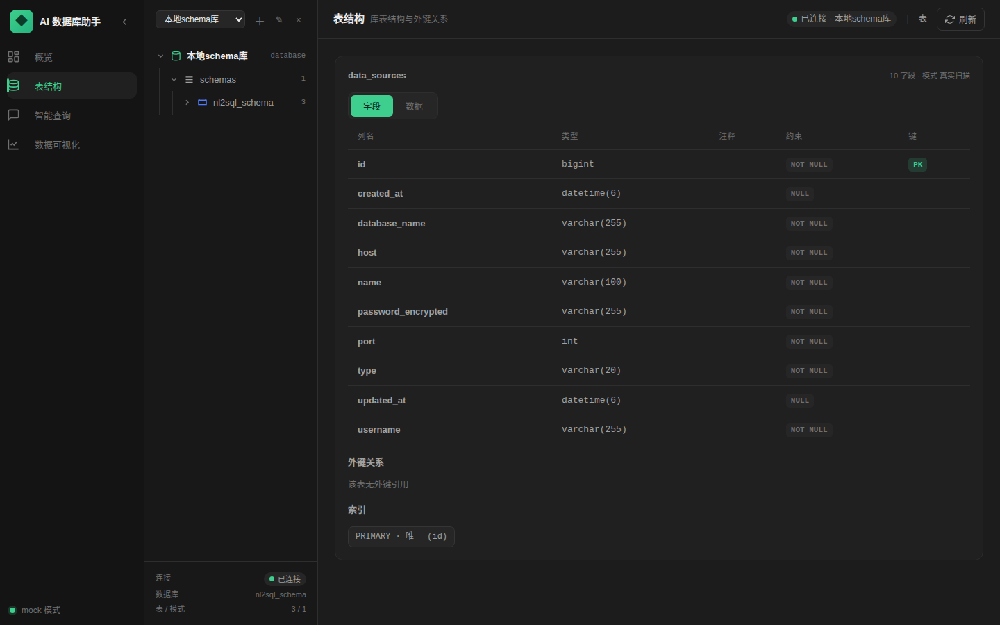
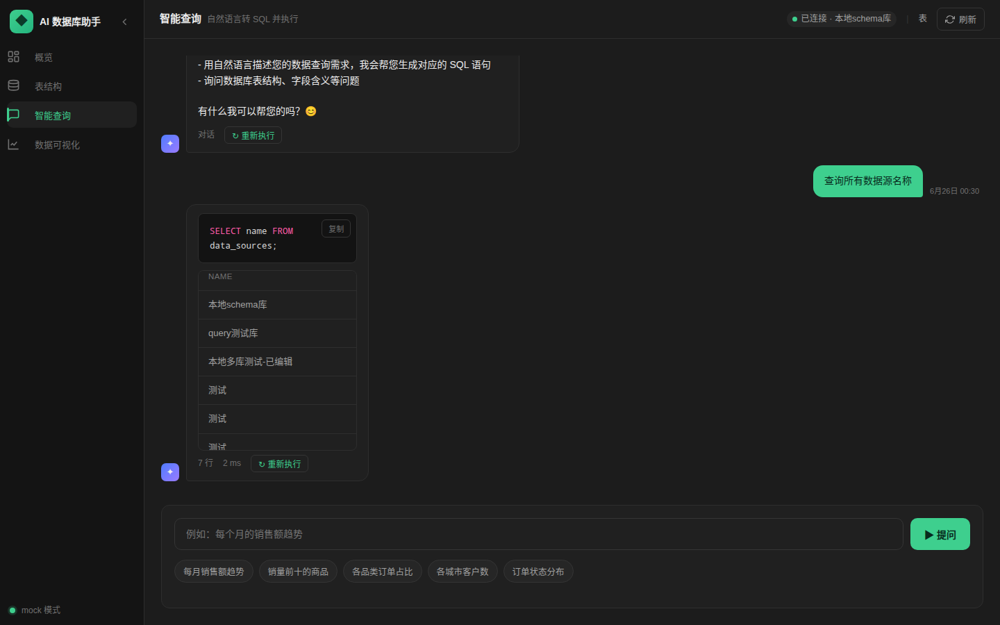
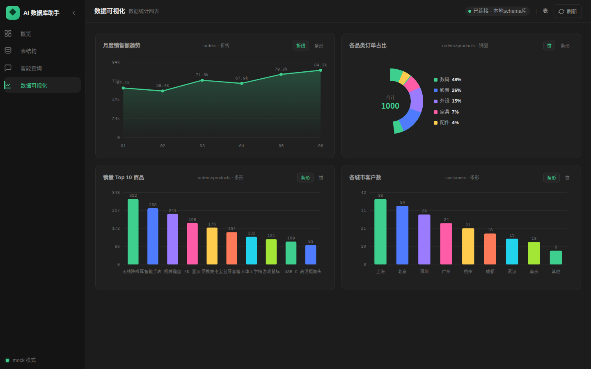

# NL2SQL Platform

AI 数据库自然语言问答平台：让非技术人员通过中文自然语言查询数据库，系统自动生成 SQL、执行并返回可视化结果。

## 核心能力

- **自然语言转 SQL**：支持中文提问，AI 自动生成并执行 SQL，返回结果表格。
- **意图识别**：对问候、闲聊、澄清类输入返回自然语言回复，避免盲目生成 SQL 报错。
- **Schema 管理**：连接 MySQL 数据源，自动扫描库表结构，展示字段、索引、外键。
- **数据可视化**：基于查询结果生成折线、条形、饼图等图表，全部使用手写 SVG，零图表库依赖。
- **会话历史**：聊天记录按会话保存，支持回看、复制 SQL、重新执行。

## 界面预览

| 概览 | 表结构 |
|------|--------|
|  |  |

| 智能查询 | 数据可视化 |
|----------|------------|
|  |  |

## 技术栈

- 前端：React 18 + TypeScript + Vite（手写 SVG 图表，零运行时图表依赖）
- 后端：Spring Boot 3.2.5 + Spring Cloud Alibaba 2023 + Java 17 + Maven（多模块）
- 中间件：MySQL 8 + Redis 7 + RabbitMQ 3.12 + Nacos 2.4
- 部署：Docker + Docker Compose

## 项目结构

```
nl2sql-platform/
├── common/              # 公共模块：DTO、统一响应、缓存/MQ/枚举/异常/i18n
├── gateway-service/     # API 网关 (8080)
├── schema-service/      # Schema 服务 (8081)
├── query-service/       # 查询服务 (8082)
├── ai-service/          # AI 服务 (8083)
├── frontend/            # 前端应用 (5173)
├── docker-compose.yml   # 基础设施编排
├── docs/                # 文档与截图
│   ├── images/          # 前端界面截图
│   └── dev/             # 开发运维文档
└── README.md
```

## 快速开始

```bash
# 1. 启动基础设施
docker compose up -d

# 2. 编译并启动业务服务（需要 JAVA_HOME 指向 JDK17）
mvn -DskipTests clean install
java -jar gateway-service/target/gateway-service-0.0.1-SNAPSHOT.jar --spring.profiles.active=local
java -jar schema-service/target/schema-service-0.0.1-SNAPSHOT.jar --spring.profiles.active=local
java -jar query-service/target/query-service-0.0.1-SNAPSHOT.jar --spring.profiles.active=local
java -jar ai-service/target/ai-service-0.0.1-SNAPSHOT.jar --spring.profiles.active=local

# 3. 启动前端
cd frontend
npm install
npm run dev
```

打开浏览器访问 http://localhost:5173 即可体验。
详细启动、重启与排错说明见 [docs/dev/operations.md](docs/dev/operations.md)。

## 主要文档

- [架构与数据流](docs/dev/architecture.md)
- [基础设施约定](docs/dev/infrastructure.md)
- [运维操作](docs/dev/operations.md)
- [初始化设计规格](docs/superpowers/specs/2026-06-16-nl2sql-init-design.md)

## 截图生成

前端截图使用 Playwright + 系统 Chrome 自动生成，脚本位于 `frontend/scripts/screenshots.cjs`。启动前后端后执行：

```bash
cd frontend
npm install -D playwright   # 首次需安装，已设置跳过浏览器下载
node scripts/screenshots.cjs
```

截图将保存到 `docs/images/`。
